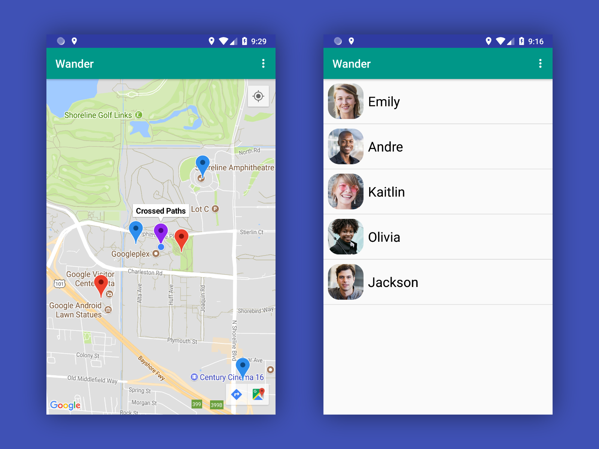
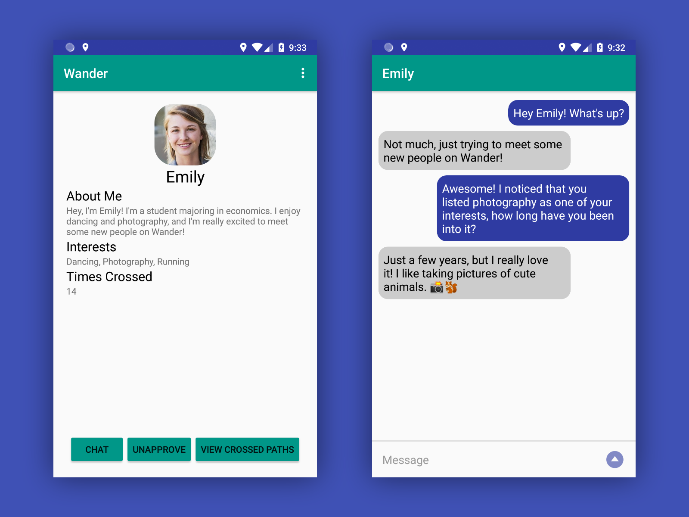
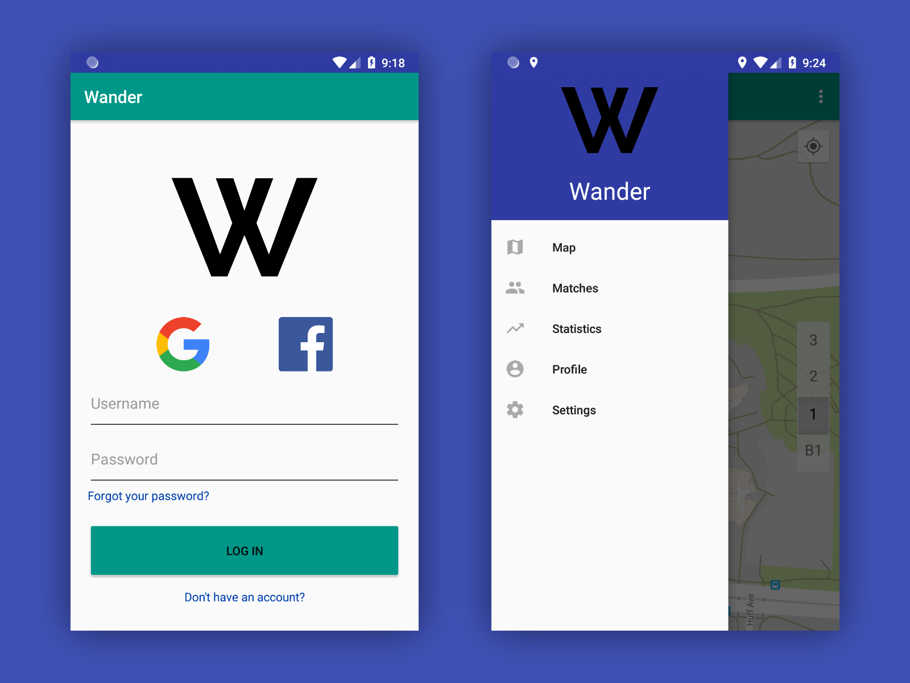

# Wander

**Wander is an application designed to connect people who cross paths multiple times during their daily routines.** Every day people walk past each other, possibly many times, without ever realizing that they crossed paths. With Wander, users are able to see a list of people they have been matched with after crossing paths multiple times, and can view the profiles of their matches. Matches can chat with each other and see locations on a map where they have crossed paths given that they have both approved each other. The app collects location data from its users, which is then sent to the Node.js server and run through an algorithm to find matches. The algorithm also determines whether or not matches share interests based on those listed on their profiles, and notifies the users if they do. Location data for the past week is stored in a MySQL database and is used to generate heat maps of a user's personal location history and the combined location history of every Wander user. The app makes it quick and easy for users to disable all location tracking, should they feel the need, with a manual toggle and the ability to set a schedule of certain times they do not want to be tracked. Never miss another potential connection again with Wander!

## Server Setup Instructions

### Prerequisites

* Node.js 9.11.1
* npm 5.8.0
* MySQL 5.7.22

### Installation

1. Setup the MySQL database

```
CREATE DATABASE database CHARACTER SET utf8mb4 COLLATE utf8mb4_unicode_520_ci;
USE database;
CREATE TABLE accounts (uid VARCHAR(16) NOT NULL, username VARCHAR(64), password VARCHAR(64), email VARCHAR(255) NOT NULL, confirmed BOOLEAN, passwordResetToken VARCHAR(64), passwordResetExpires BIGINT UNSIGNED, crossRadius SMALLINT UNSIGNED NOT NULL DEFAULT 150, googleID VARCHAR(255), facebookID VARCHAR(255), banned BOOLEAN, populationMultiplier DOUBLE UNSIGNED NOT NULL DEFAULT 1.0, matchLimit TINYINT UNSIGNED NOT NULL DEFAULT 25, PRIMARY KEY (uid), UNIQUE KEY uid (uid), UNIQUE KEY username (username), UNIQUE KEY email (email), UNIQUE KEY googleID (googleID), UNIQUE KEY facebookID (facebookID));
CREATE TABLE profiles (uid VARCHAR(16) NOT NULL, email VARCHAR(255) NOT NULL, name VARCHAR(32) DEFAULT 'No Name', about VARCHAR(255) DEFAULT 'No About', interests VARCHAR(255) DEFAULT 'No Interests', picture MEDIUMTEXT, PRIMARY KEY (uid), UNIQUE KEY uid (uid), UNIQUE KEY email (email));
CREATE TABLE locations (uid VARCHAR(16) NOT NULL, latitude DOUBLE(48,16) NOT NULL, longitude DOUBLE(48,16) NOT NULL, time BIGINT UNSIGNED NOT NULL);
CREATE TABLE firebase (registrationToken VARCHAR(255) NOT NULL, uid VARCHAR(16) NOT NULL, PRIMARY KEY (registrationToken), UNIQUE KEY registrationToken (registrationToken));
CREATE TABLE messages (uidFrom VARCHAR(16) NOT NULL, uidTo VARCHAR(16) NOT NULL, message TEXT NOT NULL, time BIGINT UNSIGNED NOT NULL);
CREATE TABLE tags (uid VARCHAR(16) NOT NULL, latitude DOUBLE(48,16) NOT NULL, longitude DOUBLE(48,16) NOT NULL, title VARCHAR(255) NOT NULL, description TEXT NOT NULL, PRIMARY KEY (uid, latitude, longitude));
CREATE TABLE offenses (uid VARCHAR(16) NOT NULL, reason TEXT NOT NULL);
CREATE USER 'username'@'localhost' IDENTIFIED BY 'password';
GRANT ALL ON database.* TO 'username'@'localhost';
FLUSH PRIVILEGES;
```

2. Install all Node.js dependencies

```
npm install
```

3. Add the variables URL, PORT, DB_HOST, DB_USERNAME, DB_PASSWORD, DB_NAME, SUPPORT_EMAIL, COOKIE_NAME, COOKIE_SECRET, COOKIE_DOMAIN, SENDGRID_API_KEY, FIREBASE_CREDENTIALS_JSON, and FIREBASE_DATABASE_URL to .env

### Running

1. Make sure MySQL is running

2. Run the Node.js server

```
node index.js
```

## Android App Setup Instructions

### Prerequisites

* Android Studio 3.1.1

### Installation

1. Set the server URL in the Data singleton class

2. Add a Google Maps API key and Facebook App ID to the appropriate files

3. Build the app and install it on an Android device

### Running

1. Launch the app on your device

## Screenshots






